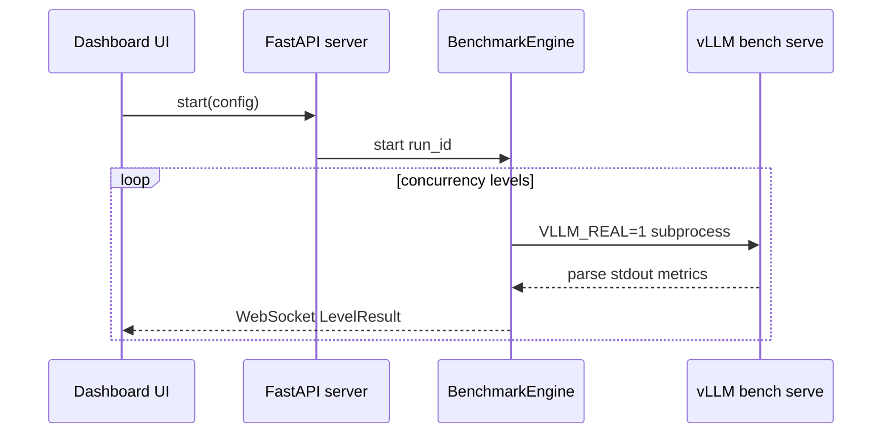
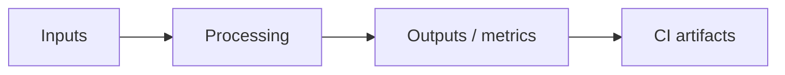
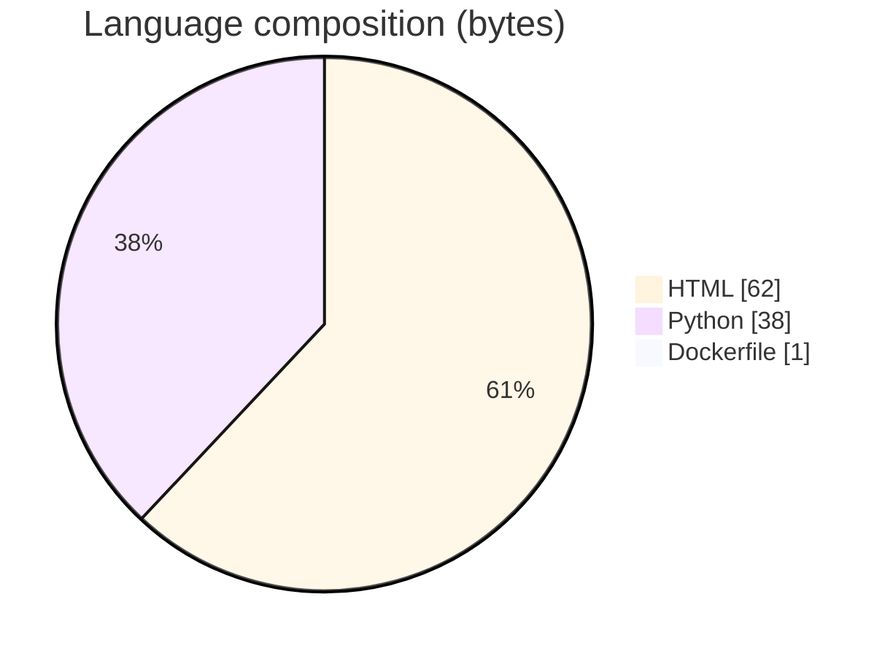

# LLM Inference Benchmarking Dashboard

### FastAPI + WebSocket dashboard that orchestrates vLLM bench serve sweeps and streams TTFT/TPOT/ITL/E2EL percentiles.

[](https://github.com/ArchanaChetan07/LLM-Inference-Benchmarking-Dashboard)
[](https://github.com/ArchanaChetan07/LLM-Inference-Benchmarking-Dashboard)
[](https://github.com/ArchanaChetan07/LLM-Inference-Benchmarking-Dashboard)
[](https://github.com/ArchanaChetan07/LLM-Inference-Benchmarking-Dashboard/actions)

---

## Overview

Running concurrency sweeps against vLLM and visualizing P50/P95/P99 latency plus GPU telemetry is tedious without a live control plane.

BenchmarkEngine drives concurrency levels (real vllm bench serve when VLLM_REAL=1, else simulation), streams LevelResult metrics over WebSockets, and ships Prometheus/Grafana/docker-compose wiring.

18-file dashboard stack covering TTFT/TPOT/ITL/E2EL style metrics with CI; defaults illustrate MI300X-oriented configs but results are workload-dependent.

This repository is maintained as **production-minded portfolio work**: clear architecture, automated checks where present, and metrics that are **traceable to committed artifacts** (never invented).

---

## Architecture

UI/WebSocket clients start a BenchmarkEngine run; engine executes per-concurrency benches (simulated or vllm bench serve), streams metrics, and optional Prometheus/Grafana scrape the backend.





---

## Results & repository facts

> Only values found in code, configs, tests, or generated reports are listed. Absence of a clinical/ML accuracy number means it was **not** published in-repo.

| Metric | Value | Source |
|---|---|---|
| Repository files | **18** | `git/trees/HEAD` |
| Default concurrency levels | **[8, 16, 32, 64, 128]** | `backend/engine.py` |
| Default input/output lengths | **4096 / 1024** | `backend/engine.py` |
| Tracked files | **18** | `git tree` |
| Python modules | **7** | `git tree` |
| Test-related paths | **2** | `git tree` |
| CI workflows | **Yes** | `.github/workflows` |
| Docker present | **Yes** | `repo root` |



---

## Key features

- Concurrency-sweep orchestration with asyncio result streaming
- TTFT/TPOT/ITL/E2EL-style LevelResult fields
- VLLM_REAL toggle for simulation vs real subprocess benches
- WebSocket subscription API for live UI updates
- Prometheus/Grafana config and dashboard JSON
- pytest + asyncio test dependencies

---

## Tech stack

| Layer | Technology |
|---|---|
| Language | Python |
| Framework | FastAPI |
| Tool | Prometheus |
| Tool | Grafana |
| Tool | Docker |
| API | vLLM bench serve |

---

## Skills demonstrated

HTML · FastAPI · WebSockets · Prometheus · Grafana · Docker Compose · pytest · CI/CD · testing · automation

Keyword surface: **Python · HTML · machine-learning · CI/CD · testing · API · Docker · automation · data-science · software-engineering · system-design · observability · LLM · cloud**

---

## Project structure

```text
LLM-Inference-Benchmarking-Dashboard/
├── backend/  # engine.py metrics.py server.py
├── configs/ dashboards/
├── Dockerfile docker-compose.yml requirements.txt
└── .github/workflows/ci.yml
```

---

## Installation & usage

```bash
git clone https://github.com/ArchanaChetan07/LLM-Inference-Benchmarking-Dashboard.git
cd LLM-Inference-Benchmarking-Dashboard
pip install -r requirements.txt
docker compose up --build
uvicorn backend.server:app --reload
VLLM_REAL=1 uvicorn backend.server:app  # real vllm bench serve
```

---

## How it works

backend/engine.py owns BenchmarkConfig/LevelResult and runs concurrency sweeps. With VLLM_REAL=0 it simulates; with VLLM_REAL=1 it shells out to vllm bench serve and parses stdout. server.py exposes HTTP + WebSocket endpoints so dashboards update live; compose wires Prometheus/Grafana.

Root README is template spam; engine docstring is the accurate operator guide. No checked-in numeric latency leaderboard beyond config defaults.

---

## Future improvements

- Check in example real-GPU result JSON for portfolio metrics
- First-class DCGM panel wiring beyond spam keywords
- Rewrite README with sequence diagram and VLLM_REAL quickstart

---

## License

See repository.

---

<p align="center">
  <b>LLM Inference Benchmarking Dashboard</b><br/>
  <a href="https://github.com/ArchanaChetan07/LLM-Inference-Benchmarking-Dashboard">github.com/ArchanaChetan07/LLM-Inference-Benchmarking-Dashboard</a>
</p>
