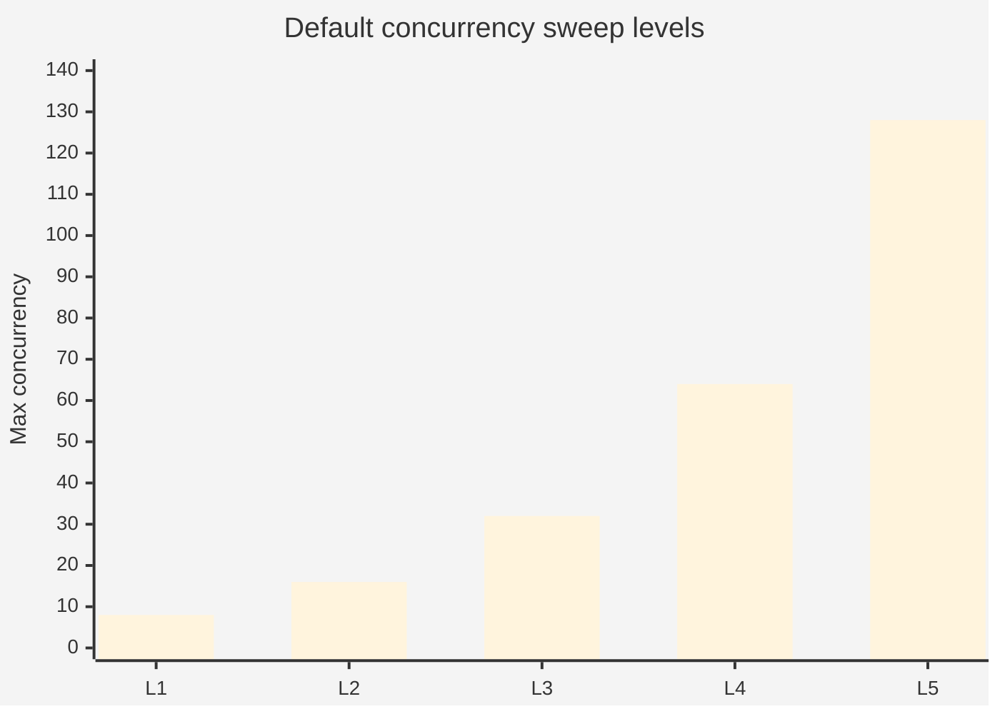
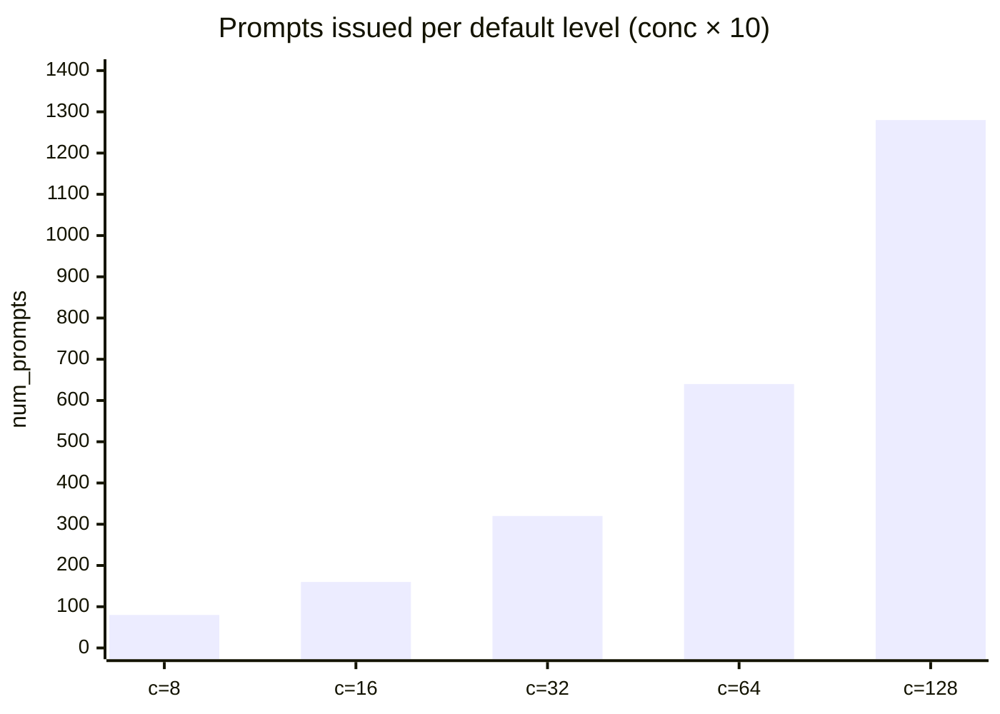
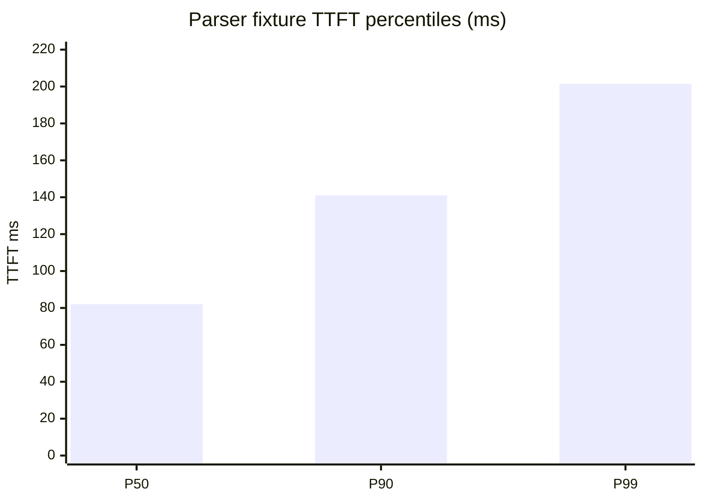
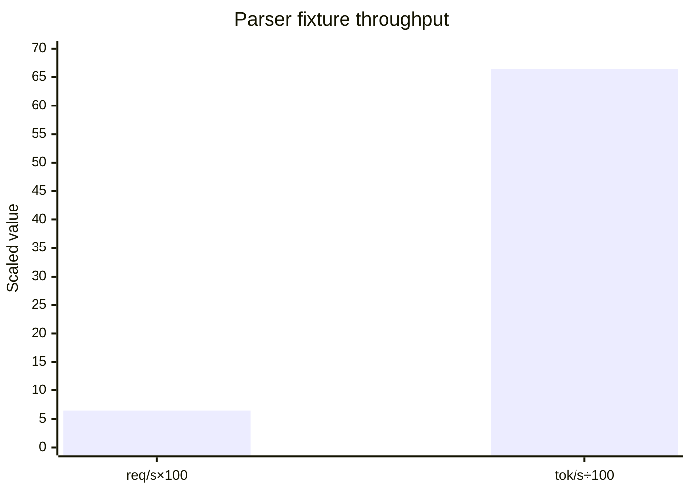
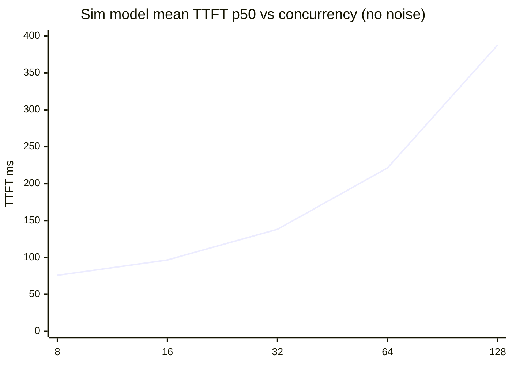
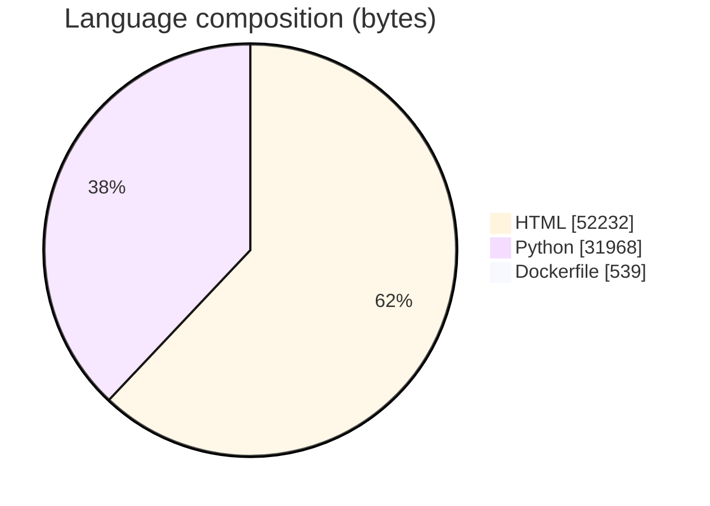
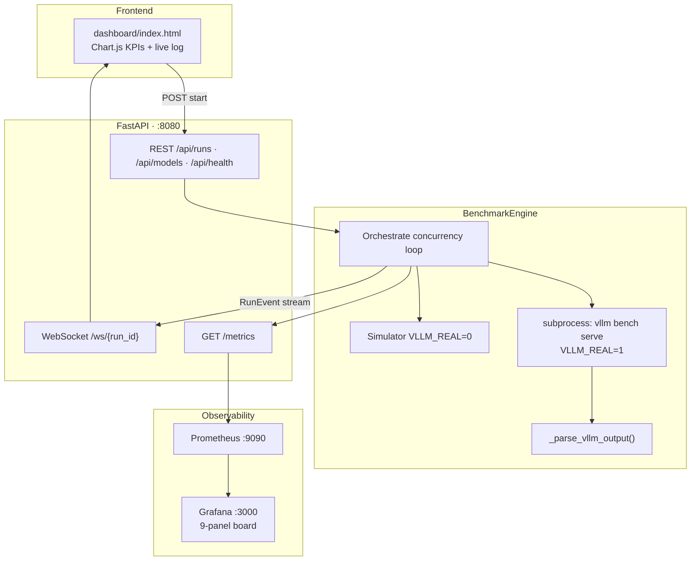
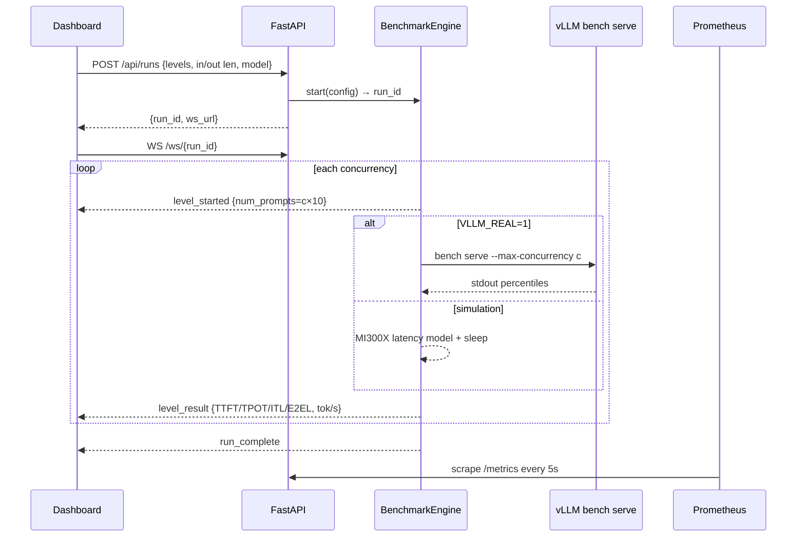
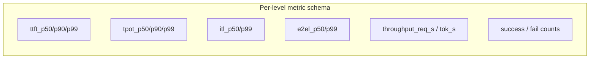
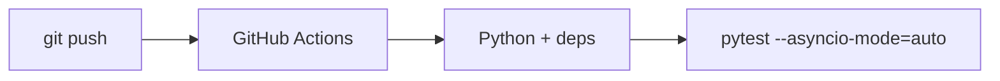

# LLM Inference Benchmarking Dashboard

### Real-time control plane for **vLLM `bench serve`** concurrency sweeps — TTFT · TPOT · ITL · E2EL · throughput streamed over WebSockets, exported to Prometheus / Grafana

<p align="center">
  
  
  
  
  
</p>

<p align="center">
  
  
  
  <a href="tests/test_engine.py"></a>
  <a href="docker-compose.yml"></a>
</p>

---

## Why this project

Measuring LLM serving quality under load usually means ad-hoc shell scripts and screenshots. This repo is a **portfolio-grade MLOps / inference engineering** stack that:

- Orchestrates **concurrency sweeps** against `vllm bench serve` (or a faithful local simulator)
- Streams **percentile latency + throughput** live to a browser dashboard via **WebSockets**
- Exposes **Prometheus** gauges/histograms and a provisioned **Grafana** board
- Ships **21 pytest** cases covering orchestration, scaling invariants, and stdout parsing

Ideal signal for roles in **ML Platform**, **Inference Engineering**, **AI Infra**, and **Observability**.

> All numbers below come from **committed code, configs, or test fixtures**. No invented GPU leaderboard. Simulation uses an explicit MI300X-oriented latency model; real hardware results require `VLLM_REAL=1`.

---

## Results & numbers (traceable)

### Default benchmark configuration (`backend/engine.py`)

| Parameter | Value |
|-----------|--------|
| Default model | `openai/gpt-oss-120b` |
| Concurrency levels | **`[8, 16, 32, 64, 128]`** |
| Input length | **4096** tokens |
| Output length | **1024** tokens |
| Prompts per level | **`concurrency × 10`** |
| Default GPU tag | **MI300X** |
| Percentile metrics requested | `ttft,tpot,itl,e2el` |
| API version | **1.0.0** |
| Model catalog size | **6** presets (`/api/models`) |





### Parser fixture metrics (committed in `tests/test_engine.py`)

These values are the **exact** sample `vllm bench serve` stdout parsed by unit tests — preserved unchanged:

| Metric | Value |
|--------|--------|
| Successful requests | **80** |
| Benchmark duration | **12.34 s** |
| Request throughput | **6.48 req/s** |
| Output token throughput | **6644.32 tok/s** |
| TTFT P50 / P99 | **82.10 ms** / **201.55 ms** |
| TPOT P50 / P99 | **10.80 ms** / **18.50 ms** |
| ITL P50 / P99 | **11.50 ms** / **27.30 ms** |
| E2EL P50 / P99 | **11.18 s** / **18.44 s** |
| Total input / output tokens (sample) | **327,680** / **81,920** |





### Simulation latency model (when `VLLM_REAL=0`)

Documented in `engine._run_simulated` (Gaussian noise omitted for the mean curve):

\[
\begin{aligned}
\mathrm{TTFT}_{p50} &\approx 55 + 2.6\,c \\
\mathrm{TPOT}_{p50} &\approx 9 + 0.14\,c \\
\mathrm{ITL}_{p50} &\approx 11 + 0.17\,c \\
\mathrm{E2EL}_{p50} &\approx (\mathrm{TTFT}_{p50} + \mathrm{TPOT}_{p50}\cdot L_{\text{out}}) / 1000
\end{aligned}
\]

Mean TTFT p50 across default concurrencies (noise-free):

| Concurrency \(c\) | ≈ TTFT p50 (ms) | ≈ TPOT p50 (ms) |
|------------------:|----------------:|----------------:|
| 8 | **75.8** | **10.12** |
| 16 | **96.6** | **11.24** |
| 32 | **138.2** | **13.48** |
| 64 | **221.4** | **17.96** |
| 128 | **387.8** | **26.92** |



Tests assert the engineering invariants this model encodes: **TTFT↑ with concurrency**, **throughput↑ with concurrency**, **P99 ≥ P50**.

### Stack footprint

| Fact | Value | Source |
|------|--------|--------|
| Tracked files | **18** | git tree |
| Languages (bytes) | HTML **52,232** · Python **31,968** · Dockerfile **539** | GitHub API |
| pytest cases | **21** | `tests/test_engine.py` |
| Grafana panels | **9** | `dashboards/grafana-benchmark.json` |
| Prometheus scrape | **every 5s** · retention **7d** | compose + `prometheus.yml` |
| Ports | API **8080** · Prometheus **9090** · Grafana **3000** | compose / Dockerfile |



---

## Architecture







---

## API surface

| Method | Path | Purpose |
|--------|------|---------|
| `POST` | `/api/runs` | Start sweep → `{run_id, ws_url}` |
| `GET` | `/api/runs` | List runs + stored `LevelResult`s |
| `GET` | `/api/runs/{id}` | Fetch one run |
| `POST` | `/api/runs/{id}/cancel` | Cooperative cancel |
| `GET` | `/api/models` | 6 model presets |
| `GET` | `/api/health` | Liveness · version `1.0.0` |
| `GET` | `/metrics` | Prometheus text exposition |
| `WS` | `/ws/{run_id}` | Live `RunEvent` stream |

**WebSocket event kinds:** `run_started` · `level_started` · `level_result` · `run_complete` · `run_error` · `run_cancelled`

**Catalog models:** GPT-OSS 120B · Llama-3 70B · Llama-3 8B · Mistral-7B · Phi-3-mini · Gemma-2 27B

---

## Observability

Prometheus metrics (selected):

| Metric | Type | Role |
|--------|------|------|
| `bench_runs_total` | Counter | Runs started |
| `bench_levels_total` | Counter | Levels measured |
| `bench_inference_requests_total` | Counter | ok / failed |
| `bench_active_runs` | Gauge | In-flight runs |
| `bench_best_ttft_p50_ms` | Gauge | Best TTFT p50 by model |
| `bench_best_throughput_tok_s` | Gauge | Best tok/s by model |
| `bench_ttft_p50_ms` / `bench_tpot_p50_ms` / `bench_throughput_req_s` | Histograms | Distribution across levels |

Grafana dashboard `llm-bench-v1` (9 panels): Total Runs · Best TTFT p50 · Best Throughput · Active Runs · Total Inference Requests · TTFT timeseries · Throughput timeseries · TTFT heatmap · TPOT timeseries. Refresh **10s**. Tags: `vllm`, `llm`, `benchmark`, `inference`, `mi300x`.

---

## Repository layout

```text
LLM-Inference-Benchmarking-Dashboard/
├── backend/
│   ├── engine.py          # BenchmarkEngine · LevelResult · vLLM parse/sim
│   ├── metrics.py         # Prometheus MetricsExporter
│   └── server.py          # FastAPI REST + WebSocket
├── dashboard/index.html   # Live UI (Chart.js)
├── dashboards/grafana-benchmark.json
├── configs/               # prometheus.yml · grafana provisioning
├── tests/test_engine.py   # 21 pytest cases
├── Dockerfile             # python:3.11-slim · uvicorn :8080
├── docker-compose.yml     # api + prometheus + grafana
└── requirements.txt
```

---

## Tech stack & keywords

| Layer | Technology |
|-------|------------|
| API | **FastAPI 0.111**, Uvicorn, Pydantic v2, WebSockets |
| Inference bench | **vLLM** `bench serve` (`VLLM_REAL=1`) |
| Metrics | **prometheus-client**, Prometheus **v2.51**, Grafana **10.4** |
| Frontend | Static HTML dashboard · live charts |
| Runtime | **Docker** / Compose · Python **3.11** |
| Quality | **pytest** + **pytest-asyncio** · GitHub Actions |

**Keyword surface:** Python · FastAPI · WebSockets · vLLM · LLM inference · TTFT · TPOT · ITL · E2EL · throughput · concurrency sweep · Prometheus · Grafana · observability · MLOps · GPU serving · MI300X · Docker · pytest · CI/CD · system design

---

## Quickstart

```bash
git clone https://github.com/ArchanaChetan07/LLM-Inference-Benchmarking-Dashboard.git
cd LLM-Inference-Benchmarking-Dashboard

# Full stack (API + Prometheus + Grafana)
docker compose up --build -d
# API http://localhost:8080/api/health
# Grafana http://localhost:3000  (admin/admin)
# Prometheus http://localhost:9090
# Open dashboard/index.html in a browser

# Local API only
pip install -r requirements.txt
uvicorn backend.server:app --host 0.0.0.0 --port 8080

# Real vLLM benches (requires vllm on PATH + reachable serve backend)
VLLM_REAL=1 uvicorn backend.server:app --port 8080

pytest tests/ -v --asyncio-mode=auto
```

Example start payload:

```bash
curl -X POST http://localhost:8080/api/runs \
  -H 'Content-Type: application/json' \
  -d '{"model":"openai/gpt-oss-120b","concurrency_levels":[8,16,32,64,128],"input_len":4096,"output_len":1024,"gpu_type":"MI300X"}'
```

---

## Testing

| Suite | Coverage |
|-------|----------|
| Config | Default levels `[8,16,32,64,128]`, 8-char `run_id` |
| Engine | Register / cancel / event ordering / multi-run isolation |
| Scaling invariants | TTFT↑ & throughput↑ vs concurrency; P99≥P50; success+fail=total; prompts=`c×10` |
| Parser | Fixture TTFT/TPOT/E2EL/throughput asserts; missing field → 0 |



---

## Roadmap

- Check in a real-GPU `results/*.json` artifact from `VLLM_REAL=1` for portfolio latency tables  
- Surface DCGM / GPU utilization next to TTFT panels  
- Persist run history to SQLite/Postgres for multi-session compare  

---

<p align="center">
  <b>LLM Inference Benchmarking Dashboard</b><br/>
  <a href="https://github.com/ArchanaChetan07/LLM-Inference-Benchmarking-Dashboard">github.com/ArchanaChetan07/LLM-Inference-Benchmarking-Dashboard</a>
</p>
